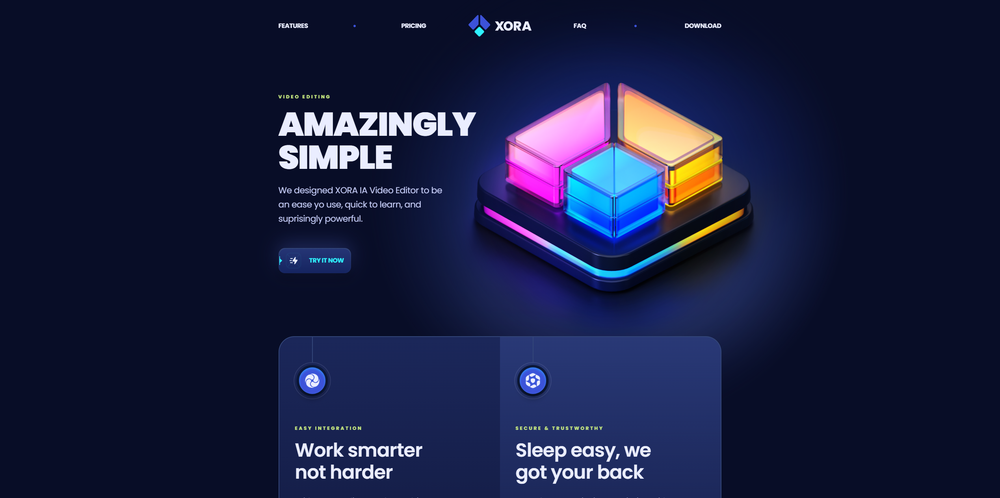
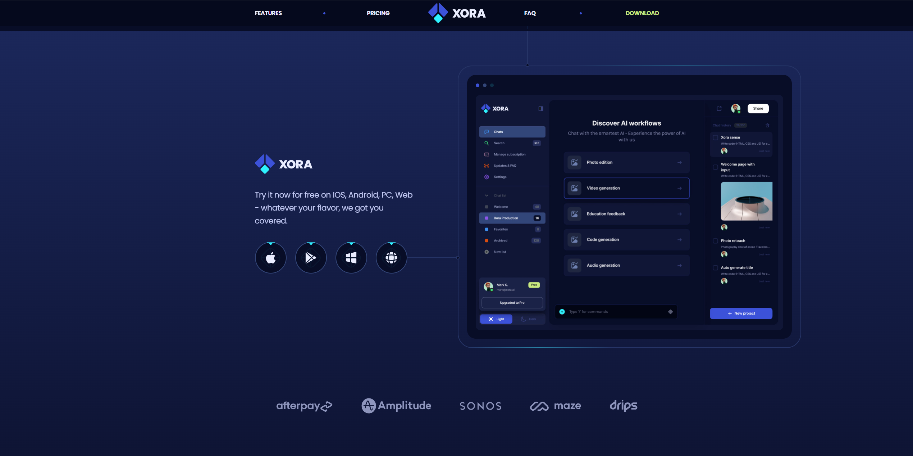

# Saas Landing Page


A responsive SaaS landing page built with React, Vue, Vite, and Tailwind CSS, deployed on GitHub Pages.

## Table of Contents

- [About the Project](#about-the-project)
- [Demo](#demo)
- [Installation](#installation)
- [Usage](#usage)
- [Technologies](#technologies)
- [Folder Sctructure](#folder-sctructure)
- [Contrubuting](#contributing)
- [Licence](#licence)
- [Contact](#contact)

---

## About the Project
Xora is a Modern UI/UX SaaS website developed using React.js and Tailwind CSS that exemplifies modern UI/UX principles. Its sleek design, seamless animations, and overall user experience set a high standard, serving as a reference or inspiration for future modern applications or websites in general.

### Build With
- [React](https://reactjs.org/)
- [Vite](https://vitejs.dev/)
- [Tailwind CSS](https://tailwindcss.com/)

---

## Demo

Check out the live verstion here: [Link](https://volosevych.github.io/saas-landing-page/)

### Screenshots



---

## Installation
Follow these steps to install and set up the project locally.

```bash
# Clone the repo
git clone https://github.com/your-username/project-name.git

# Navigate to the project directory
cd project-name

# Install dependencies
npm install

# Start the development server
npm run dev


project-root
├── public              # Static assets
├── src                 # Source files
│   ├── components      # Reusable components
│   ├── pages           # Pages
│   ├── styles          # Styling files
│   ├── utils           # Utility functions
│   └── App.jsx         # Main app component
└── README.md           # Readme file
